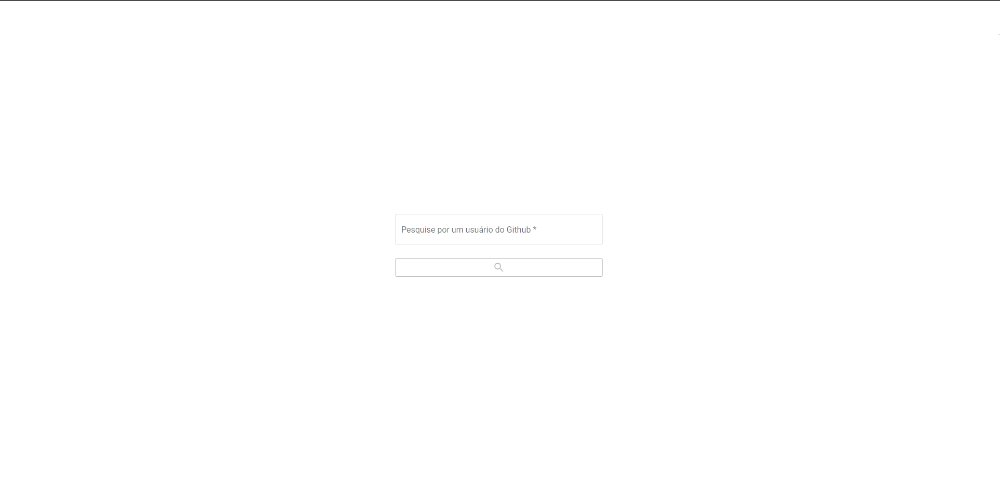
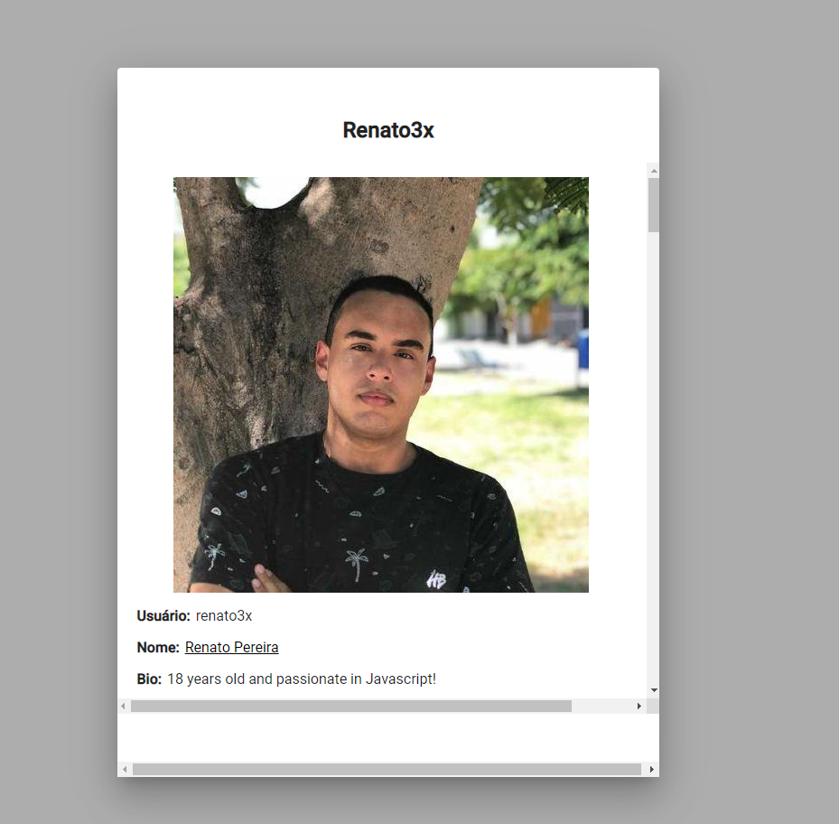
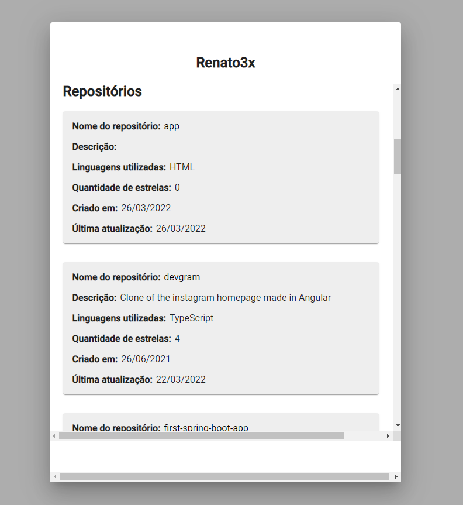

<h1 align="center">Mini projeto - Busca de perfil no Github</h1>

**Como utilizar:** Bastar dar npm install que será instalada todas as dependências necessárias para a aplicação funcionar.

**Tecnologia utilizada:** Angular e angular material.

